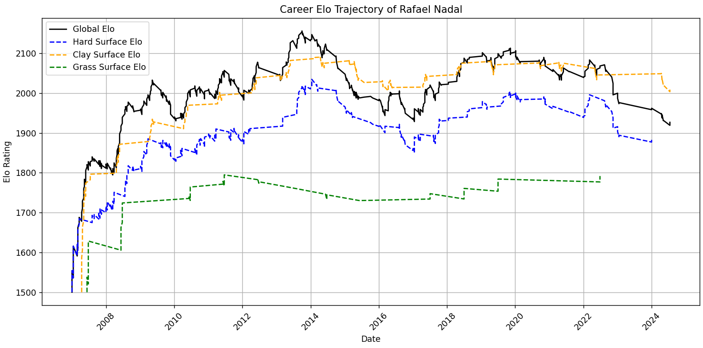
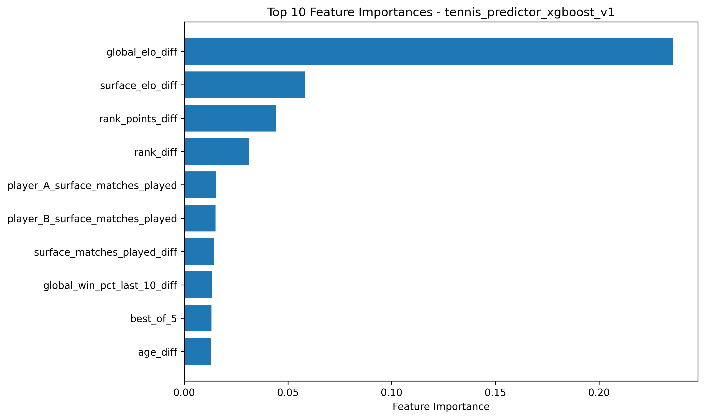

# Tennis ML Predictor

This **Tennis ML Predictor** is a machine learning system designed to predict the outcome of professional tennis matches using historical match data, player performance statistics, and engineered contextual features such as Elo ratings, surface-specific strength, and recent form.

The project explores multiple modelling approaches, from a classical Elo rating system to neural networks and gradient boosted decision trees, to evaluate how different modelling techniques perform on structured sports prediction data.

The primary goal is to build an accurate, interpretable, and extensible prediction pipeline that can evolve with additional data and feature engineering improvements.

## This repository includes
The full end-to-end tennis prediction pipeline:

- **Live data fetching, preprocessing & cleaning**
  - Live data sourcing from [Jeff Sackmann’s ATP dataset](https://github.com/JeffSackmann/tennis_atp)
  - Coverage of 60,000+ ATP matches across 20+ years of professional tennis history
  - Feature-safe chronological processing to prevent data leakage

- **Feature engineering**
  - Elo rating system (global + surface-specific)
  - Recent form and rolling performance metrics
  - Fatigue / rest-day calculations
  - Matchup-based differential features
  - Serve / return performance indicators

- **Model training pipeline**
  - Unified training entry point (`src/pipelines/train.py`)
  - Configurable model selection (`elo`, `mlp`, `xgboost`)
  - Reproducible train/test pipeline

- **Prediction system**
  - Match-level win probability prediction
  - Consistent feature transformation pipeline

- **Evaluation framework**
  - Model comparison across architectures
  - Evaluation using accuracy, log loss, and Brier score with chronological validation

## Setup

### Step 0: Ensure Python and pip are installed

```bash
python --version
pip --version
```

### Step 1: Create and activate a virtual environment

Windows PowerShell:

```powershell
python -m venv .venv
Set-ExecutionPolicy -ExecutionPolicy RemoteSigned -Scope CurrentUser
.\.venv\Scripts\Activate.ps1
```

macOS/Linux:

```bash
python -m venv .venv
source .venv/bin/activate
```

### Step 2: Install dependencies

```bash
pip install -r requirements.txt
```

### Step 3: Train a model

Training is implemented in `src/pipelines/train.py`.

```bash
python -m src.pipelines.train
```

Supported executable parameters:
- `--model`: The type of model to train tennis data on, including `elo`, `mlp`, and `xgboost` (default).

## Models

### TennisPredictorElo

A classical Elo-based rating system adapted for tennis.

Each player is assigned a dynamic rating that updates after every match based on expected vs actual performance.

**Elo update formula:**

$$
R_{new} = R_{old} + K \cdot (S - E)
$$

Where:
- $R_{old}$: current rating  
- $K$: K-Factor / volatility constant  
- $S$: actual match result (1 = win, 0 = loss)  
- $E$: expected win probability based on rating difference  

Expected score:

$$
E_A = \frac{1}{1 + 10^{(R_B - R_A)/400}}
$$

This model provides a strong baseline and forms the foundation for more complex feature engineering.


*Career Elo trajectory of Rafael Nadal over his professional career, showing long-term performance evolution and surface dominance.*

### TennisPredictorMLP

A feedforward neural network trained on engineered match features.

- Input: numerical feature vector (Elo diffs, form, fatigue, etc.)
- Architecture: fully connected layers with nonlinear activations
- Output: probability of Player A winning

The MLP is capable of learning nonlinear interactions between features (e.g. how fatigue and surface interact), but can be sensitive to feature scaling and data distribution.

### TennisPredictorXGBoost

A gradient boosted decision tree model trained on the same engineered feature set.

This is currently my **preferred model** for this project due to its:

- Strong performance on structured/tabular data
- Robustness to feature scaling
- Built-in handling of nonlinear feature interactions
- Interpretability via feature importance analysis

One of its biggest advantages is interpretability: we can directly evaluate which features contribute most to predictive power.


*Top 10 feature importances from the trained XGBoost model, showing the most influential variables used in match outcome prediction.*

## Acknowledgements

Many thanks to **Jeff Sackmann** and the wider **Tennis Abstract** community for their ongoing efforts in providing and maintaining publicly available tennis datasets.

- [Jeff Sackmann’s ATP dataset](https://github.com/JeffSackmann/tennis_atp)
- https://www.tennisabstract.com/

## Tennis ML Predictor API
Coming soon!
